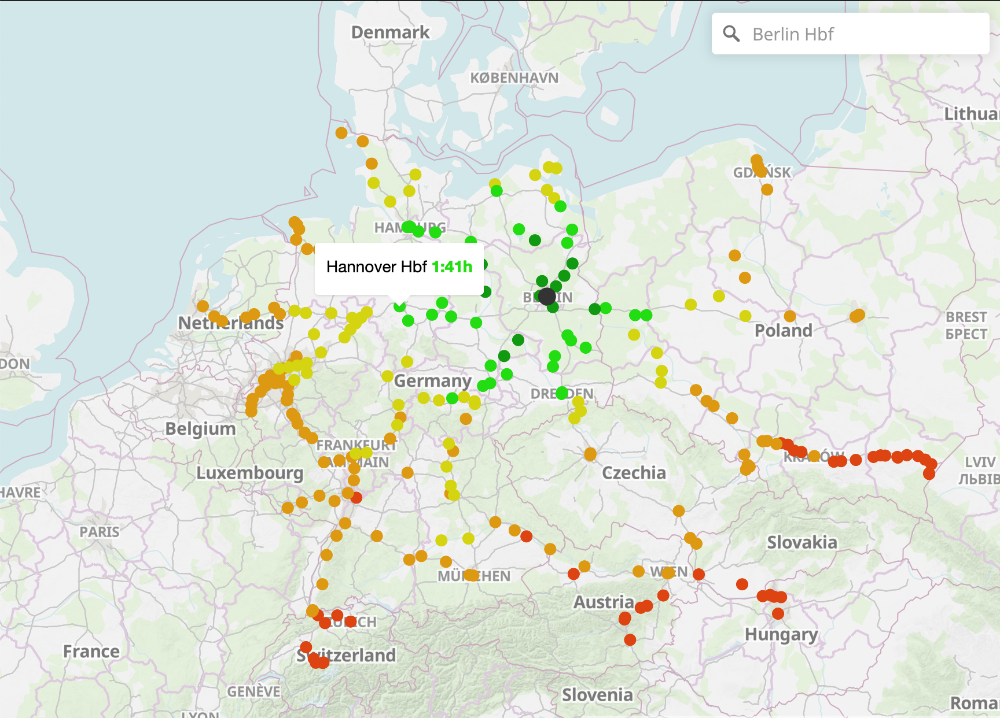

# europe-train-distance-mapbox-location

# 🚀 All direct long-distance railway connections for cities in Germany. 🚀

https://github.com/coding-to-music/europe-train-distance-mapbox-location

From / By Julius Tens https://github.com/juliuste

https://github.com/juliuste/direkt.bahn.guru

## Environment variables:

```java

```

## GitHub

```java
git init
git add .
git remote remove origin
git commit -m "first commit"
git branch -M main
git remote add origin git@github.com:coding-to-music/europe-train-distance-mapbox-location.git
git push -u origin main

```

# direkt.bahn.guru

**[direkt.bahn.guru](https://direkt.bahn.guru/)** All direct long-distance railway connections from a given city.

[](license)
[](mailto:mail@juliustens.eu)

[](https://direkt.bahn.guru)

## See also

- [bahn.guru](https://github.com/juliuste/bahn.guru) - Find the cheapest Deutsche Bahn "Sparpreise" (low-cost tickets) for the next month.
- [pricemap.eu](https://github.com/juliuste/travel-price-map) - Map of cheapest railway and bus (coach) travel prices between several european cities.
- [api.direkt.bahn.guru](https://github.com/juliuste/api.direkt.bahn.guru) - Backend for this service

## Contributing

If you found a bug or want to propose a feature, feel free to visit [the issues page](https://github.com/juliuste/direkt.bahn.guru/issues).
